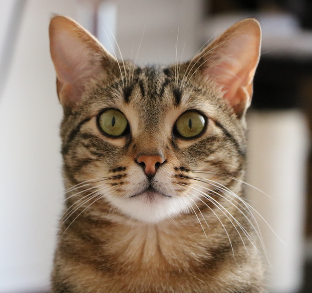

<!-- README.md is generated from README.Rmd. Please edit that file -->

```{r, echo = FALSE}
knitr::opts_chunk$set(
  collapse = TRUE,
  comment = "#>",
  fig.path = "README-"
)
```

```{r echo = FALSE}
library(tipixel)
library(magick)
library(tibble)

temp <- function(x){
tf <- tempfile( fileext = ".png")
image_write(x, tf) 
tf
}


```

Meet Tigrou



```{r}
tigrou <- image_read( system.file("tigrou", "tigrou.jpg", package = "tipixel") )
```

## pixel_replace

Tigrou with every 25x25 replaced by another kitty 

```{r}
pixel_replace( tigrou, tiles = kittens, size = 25)
```

```{r echo = FALSE}
tf <- temp( pixel_replace( tigrou, tiles = kittens, size = 25) )
```


## pixel_quality

A measure of the quality of the tiles. 

```{r}
pixel_quality( tigrou, tiles = kittens, size = 25)
```

```{r echo = FALSE}
tf <- temp( pixel_quality( tigrou, tiles = kittens, size = 25) )
```


## pixel_grid

Showing the grid

```{r}
pixel_grid( tigrou, size = 25)
```

```{r echo = FALSE}
tf <- temp( pixel_grid( tigrou, size = 25) )
```


## tiles

The tiles argument of these functions expect a tibble similar to the `kittens` (or `puppies`) that is shipped 
with the package: 

```{r}
kittens
puppies
```

Each row represent a tile, which has a given color (identified by the `red`, `green`, `blue` and `alpha` columns). 
The `tile` column is a list column holding the data for the tiles. 

```{r}
kittens$tile[[1]]
```

The `tiles` function can make one of these tiles tibbles: 

```{r}
files   <- list.files( system.file("base", package = "tipixel"), pattern = "jpg$", full.names = TRUE )
samples <- tiles( files, size = 25 )
samples
```

## tiles_mono 

The `tiles_mono` function generates monochromatic tiles. For example, here is Tigrou
with each 25x25 square replaced by the closest R color. 

```{r}
rtiles <- tiles_mono(colors())
pixel_replace( tigrou, tiles = rtiles, size = 25)
```

```{r echo = FALSE}
tf <- temp( pixel_replace( tigrou, tiles = rtiles, size = 25) )
```


## tiles_animals

The `tiles_animals` function scraps data. For example, the `kittens` and 
`puppies` have been generated with : 

```{r, eval=FALSE}
kittens <- tiles_animals(what = "bebe,chats", pages = 1:10)
puppies <- tiles_animals(what = "bebe,chiens", pages = 1:10)
```

