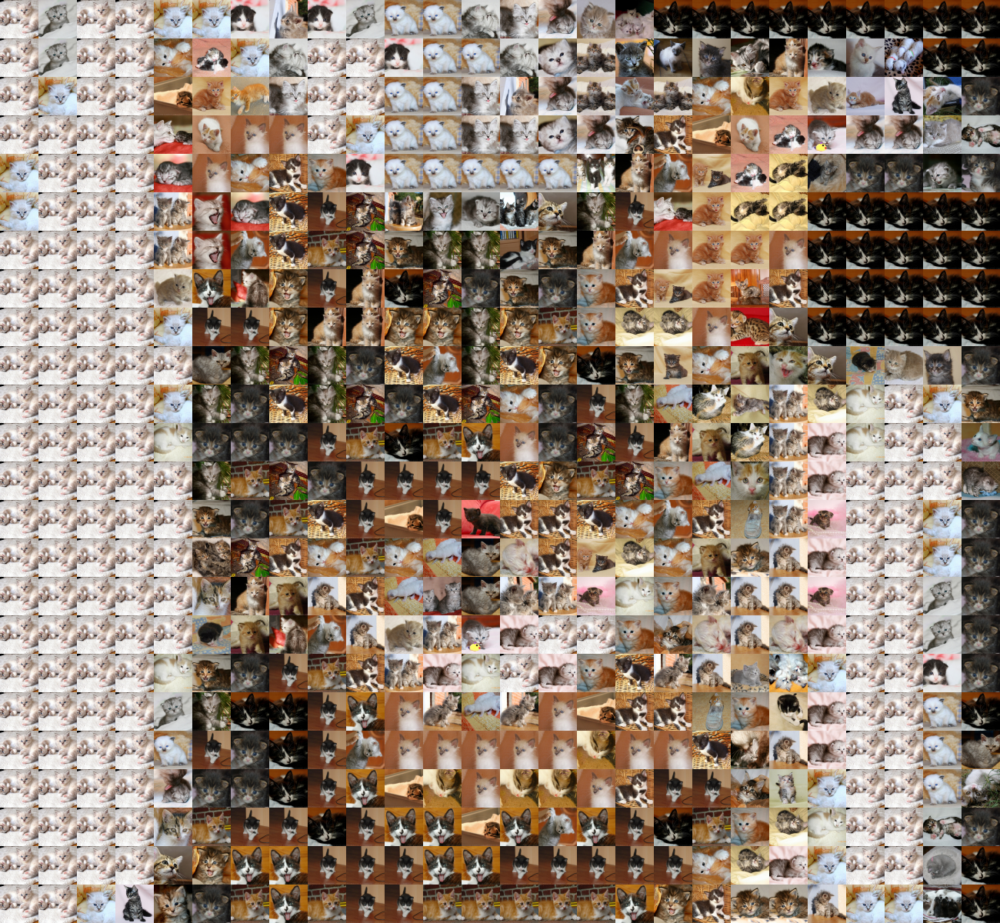

[](https://travis-ci.org/ThinkRstat/collage)

<!-- README.md is generated from README.Rmd. Please edit that file -->

```{r, echo = FALSE}
knitr::opts_chunk$set(
  collapse = TRUE,
  comment = "#>",
  fig.path = "README-"
)
```

```{r echo = FALSE}
library(tibble)
```

Meet Tigrou


```{r}
library(collage)
library(magick)

tigrou <- image_read( system.file("tigrou", "tigrou.jpg", package = "collage") )
```

## collage

Tigrou with every 25x25 replaced by another kitty

```{r}
collage( tigrou, tiles = kittens, size = 25)
```

```{r echo = FALSE}
image_write( collage( tigrou, tiles = kittens, size = 25), path = "images/collage.png" )
```



with every 10x10 replaced by a useR 2017 attendee:

```{r}
collage( tigrou, tiles = useR2017, size = 10)
```

```{r echo = FALSE}
image_write( collage( tigrou, tiles = useR2017, size = 10), path = "images/collage_useR.png" )
```


## collage_quality

A measure of the quality of the tiles.

```{r}
collage_quality( tigrou, tiles = kittens, size = 25)
```

```{r echo = FALSE}
image_write( collage_quality( tigrou, tiles = kittens, size = 25), path = "images/collage_quality.png" )
```


## collage_grid

Showing the grid

```{r}
collage_grid( tigrou, size = 25)
```

```{r echo = FALSE}
image_write( collage_grid( tigrou, size = 25), path = "images/collage_grid.png" )
```


## tiles

The tiles argument of these functions expect a tibble similar to the `kittens` (or `puppies`) that is shipped
with the package:

```{r}
kittens
puppies
```

Each row represent a tile, which has a given color (identified by the `red`, `green`, `blue` and `alpha` columns).
The `tile` column is a list column holding the data for the tiles.

```{r}
kittens$tile[[1]]
```

The `tiles` function can make one of these tiles tibbles:

```{r}
files   <- list.files( system.file("base", package = "collage"), pattern = "jpg$", full.names = TRUE )
samples <- tiles( files, size = 25 )
samples
```

## tiles_mono

The `tiles_mono` function generates monochromatic tiles. For example, here is Tigrou
with each 25x25 square replaced by the closest R color.

```{r}
rtiles <- tiles_mono(colors())
collage( tigrou, tiles = rtiles, size = 25)
```

```{r echo = FALSE}
image_write( collage( tigrou, tiles = rtiles, size = 25), path = "images/collage_rcolors.png" )
```


## tiles_animals

The `tiles_animals` function scraps data. For example, the `kittens` and
`puppies` have been generated with :

```{r, eval=FALSE}
kittens <- tiles_animals(what = "bebe,chats", pages = 1:20)
puppies <- tiles_animals(what = "bebe,chiens", pages = 1:20)
```
