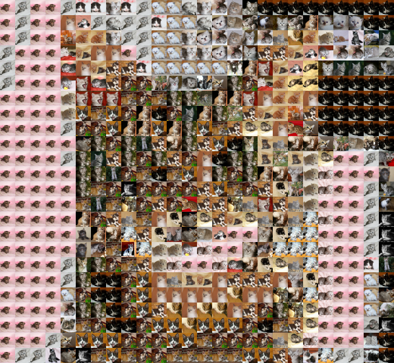
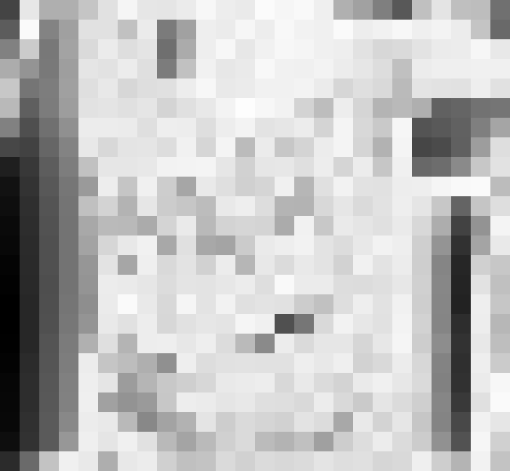
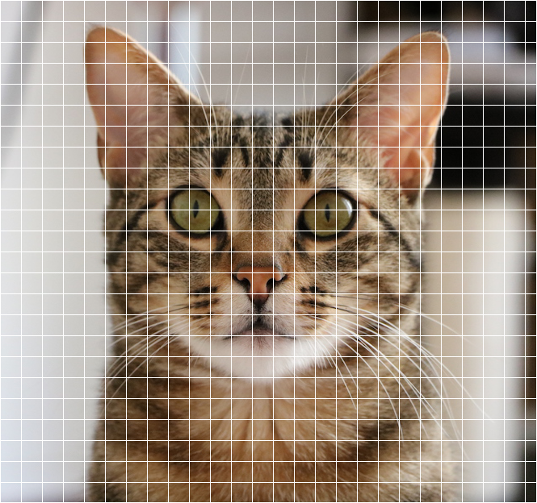
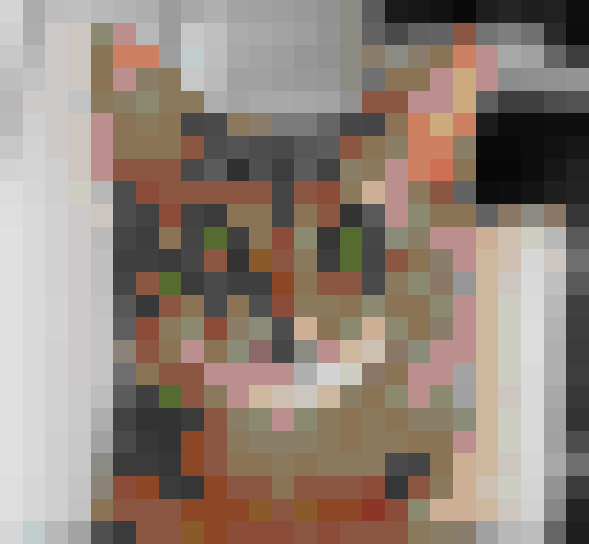

<!-- README.md is generated from README.Rmd. Please edit that file -->
Meet Tigrou


``` r
tigrou <- image_read( system.file("tigrou", "tigrou.jpg", package = "tipixel") )
```

pixel\_replace
--------------

Tigrou with every 25x25 replaced by another kitty

``` r
pixel_replace( tigrou, tiles = kittens, size = 25)
#>   format width height colorspace filesize
#> 1    png   650    600       sRGB        0
```



pixel\_quality
--------------

A measure of the quality of the tiles.

``` r
pixel_quality( tigrou, tiles = kittens, size = 25)
#>   format width height colorspace filesize
#> 1    png   650    600       sRGB        0
```



pixel\_grid
-----------

Showing the grid

``` r
pixel_grid( tigrou, size = 25)
#>   format width height colorspace filesize
#> 1    png   665    624       sRGB        0
```



tiles
-----

The tiles argument of these functions expect a tibble similar to the `kittens` (or `puppies`) that is shipped with the package:

``` r
kittens
#> # A tibble: 200 x 5
#>      red green  blue alpha         tile
#>    <raw> <raw> <raw> <raw>       <list>
#>  1    81    4e    50    ff <S3: bitmap>
#>  2    b5    a9    a8    ff <S3: bitmap>
#>  3    ad    a4    9c    ff <S3: bitmap>
#>  4    a6    99    89    ff <S3: bitmap>
#>  5    a4    69    47    ff <S3: bitmap>
#>  6    cb    a9    aa    ff <S3: bitmap>
#>  7    82    74    57    ff <S3: bitmap>
#>  8    74    5e    4a    ff <S3: bitmap>
#>  9    94    81    8b    ff <S3: bitmap>
#> 10    86    85    83    ff <S3: bitmap>
#> # ... with 190 more rows
puppies
#> # A tibble: 200 x 5
#>      red green  blue alpha         tile
#>    <raw> <raw> <raw> <raw>       <list>
#>  1    96    7b    5f    ff <S3: bitmap>
#>  2    71    72    50    ff <S3: bitmap>
#>  3    47    46    43    ff <S3: bitmap>
#>  4    a1    85    70    ff <S3: bitmap>
#>  5    6a    70    74    ff <S3: bitmap>
#>  6    5d    60    53    ff <S3: bitmap>
#>  7    a3    8c    5d    ff <S3: bitmap>
#>  8    ac    9d    8b    ff <S3: bitmap>
#>  9    79    6f    5d    ff <S3: bitmap>
#> 10    70    72    70    ff <S3: bitmap>
#> # ... with 190 more rows
```

Each row represent a tile, which has a given color (identified by the `red`, `green`, `blue` and `alpha` columns). The `tile` column is a list column holding the data for the tiles.

``` r
kittens$tile[[1]]
#> 4 channel 25x25 bitmap array: 'bitmap' raw [1:4, 1:25, 1:25] 0c 0e 0d ff ...
```

The `tiles` function can make one of these tiles tibbles:

``` r
files   <- list.files( system.file("base", package = "tipixel"), pattern = "jpg$", full.names = TRUE )
samples <- tiles( files, size = 25 )
samples
#> # A tibble: 54 x 5
#>      red green  blue alpha         tile
#>    <raw> <raw> <raw> <raw>       <list>
#>  1    86    96    a3    ff <S3: bitmap>
#>  2    d7    bc    b2    ff <S3: bitmap>
#>  3    d7    b6    c1    ff <S3: bitmap>
#>  4    c2    82    90    ff <S3: bitmap>
#>  5    b9    94    ae    ff <S3: bitmap>
#>  6    8d    5c    3a    ff <S3: bitmap>
#>  7    7e    76    70    ff <S3: bitmap>
#>  8    8c    92    a5    ff <S3: bitmap>
#>  9    87    7f    66    ff <S3: bitmap>
#> 10    a6    af    8c    ff <S3: bitmap>
#> # ... with 44 more rows
```

tiles\_mono
-----------

The `tiles_mono` function generates monochromatic tiles. For example, here is Tigrou with each 25x25 square replaced by the closest R color.

``` r
rtiles <- tiles_mono(colors())
pixel_replace( tigrou, tiles = rtiles, size = 25)
#>   format width height colorspace filesize
#> 1    png   650    600       sRGB        0
```



tiles\_animals
--------------

The `tiles_animals` function scraps data. For example, the `kittens` and `puppies` have been generated with :

``` r
kittens <- tiles_animals(what = "bebe,chats", pages = 1:20)
puppies <- tiles_animals(what = "bebe,chiens", pages = 1:20)
```
